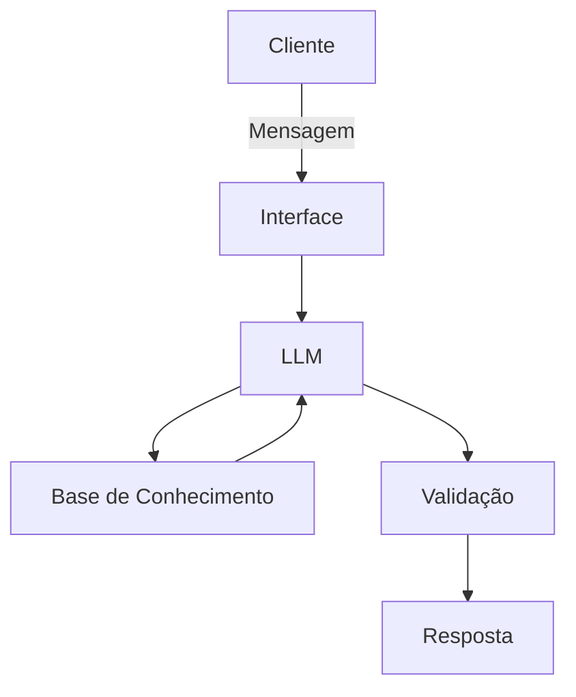

# Documentação do Agente

## Caso de Uso

### Problema
> Qual problema financeiro seu agente resolve?

lientes iniciantes geralmente têm dificuldade para organizar orçamento, interpretar risco e escolher produtos financeiros compatíveis com seu perfil. Isso pode levar a decisões impulsivas, desalinhamento entre objetivo e produto e baixa disciplina financeira no dia a dia.

### Solução
> Como o agente resolve esse problema de forma proativa?

O agente híbrido de **Saúde Financeira + Suitability Educativo** analisa dados de transações, perfil do investidor, histórico de atendimento e produtos financeiros para:
- identificar padrões de gastos e possíveis sinais de risco;
- explicar de forma simples a compatibilidade entre perfil e produtos;
- sugerir ações práticas de curto prazo (organização financeira, metas e prioridades);
- orientar próximos passos com segurança e transparência, sem prometer rentabilidade.

### Público-Alvo
> Quem vai usar esse agente?

- Iniciantes em finanças pessoais e investimentos;
- Clientes de bancos/fintechs que buscam orientação educativa;
- Usuários com dificuldade para controlar gastos e planejar objetivos financeiros;
- Pessoas que querem entender melhor risco, liquidez e adequação de produtos.

---

## Persona e Tom de Voz

### Nome do Agente
**FINA+ (Financial Intelligence & Advisory Plus)**

### Personalidade
> Como o agente se comporta? (ex: consultivo, direto, educativo)

Consultivo, educativo e responsável.  
O agente atua como um orientador financeiro digital: explica conceitos com clareza, evita jargões desnecessários e sempre propõe próximos passos práticos.

### Tom de Comunicação
> Formal, informal, técnico, acessível?

Tom **profissional e acessível**: linguagem simples para iniciantes, com precisão técnica quando necessário.

### Exemplos de Linguagem
- Saudação: "Olá! Posso te ajudar a entender seus gastos e encontrar opções compatíveis com seu perfil."
- Confirmação: "Perfeito, entendi seu objetivo. Vou analisar e te mostrar as opções de forma simples."
- Erro/Limitação: "Não tenho dados suficientes para concluir com segurança agora, mas posso te orientar com base no que já temos."

---

## Arquitetura

### Diagrama

### Componentes

| Componente | Descrição |
|------------|-----------|
| Interface | Chatbot em Streamlit |
| LLM | Modelo generativo via API (com fallback local) |
| Base de Conhecimento | Arquivos JSON/CSV com transações, perfil do investidor, histórico de atendimento e produtos financeiros |
| Validação | Regras de segurança, checagem de aderência ao perfil e prevenção de alucinações |

---

## Segurança e Anti-Alucinação

### Estratégias Adotadas

- [ ] Agente só responde com base nos dados fornecidos e no contexto da conversa
- [ ] Respostas indicam contexto utilizado (perfil, transações e produtos)
- [ ] Quando faltam dados, o agente admite limitação e redireciona com segurança
- [ ] Não faz recomendação assertiva de investimento sem perfil do cliente

### Limitações Declaradas
> O que o agente NÃO faz?

- Não promete ganhos ou rentabilidade futura;
- Não executa transações financeiras reais;
- Não substitui consultoria financeira regulada;
- Não solicita dados sensíveis (senha, token, CVV, OTP);
- Não recomenda produtos de alto risco sem alertar adequação e risco;
- Não conclui diagnósticos definitivos com dados incompletos.
